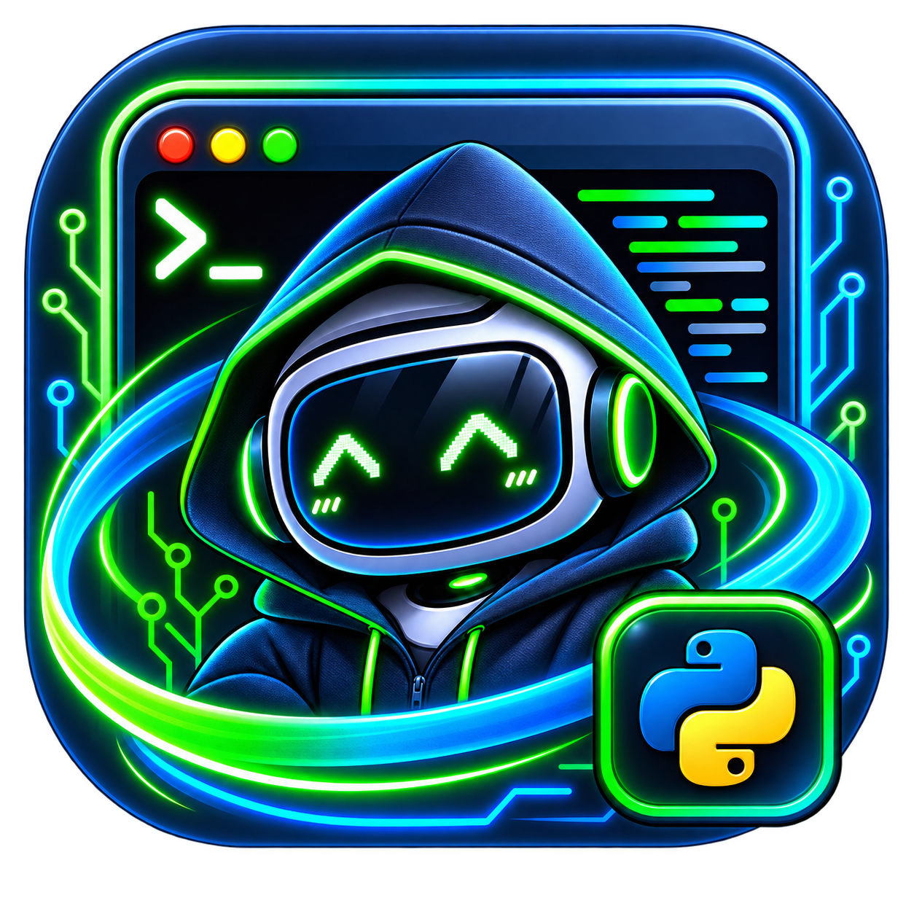

# 👋 Halo, saya Candri Panjaitan

💻 Saya suka membuat dan mengembangkan **aplikasi desktop**.

Saya tertarik dengan dunia software development dan senang membuat berbagai project untuk belajar, bereksperimen, dan mencoba hal-hal baru.

---

## 🚀 Project

<table>
  <tr>
    <td align="center">
      
       
      <b>ChanSecurity</b>
    </td>
    <td align="center">
      
       
      <b>OPENTCS</b>
    </td>
  </tr>
</table>

---

## 🛠️ Yang Saya Suka

* 🖥️ Aplikasi Desktop
* 💻 Software Development
* ⚙️ Membuat berbagai project
* 🧠 Belajar teknologi baru
* 🚀 Bereksperimen dengan ide-ide baru

---

<<<<<<< HEAD

<b>Membangun solusi digital yang bermanfaat untuk banyak orang.</b>

=======
  <i>Terima kasih sudah berkunjung ke profil saya! 👋</i>

>>>>>>> 2a8f058 (Update)
